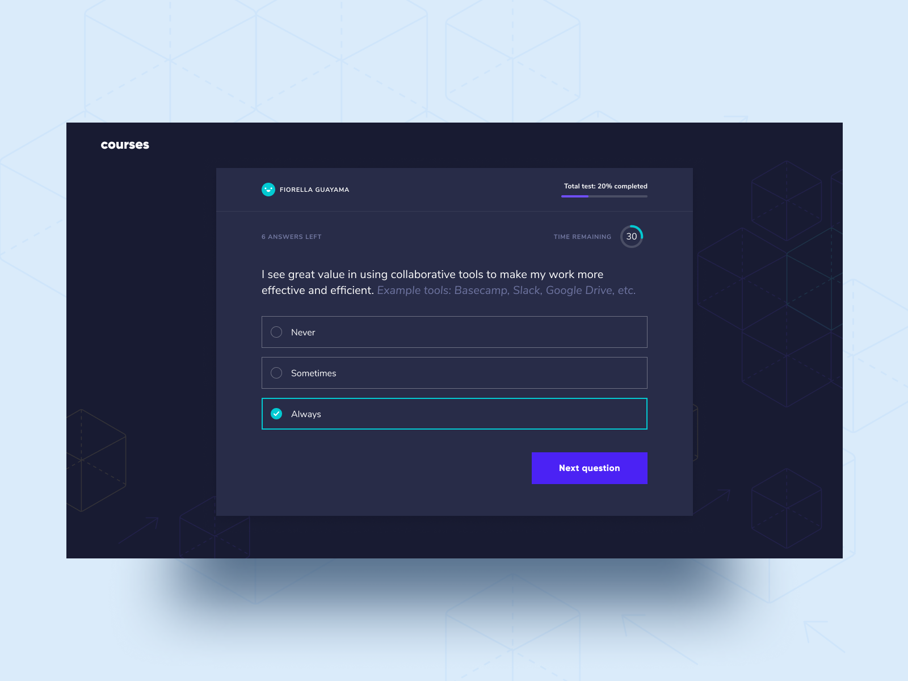
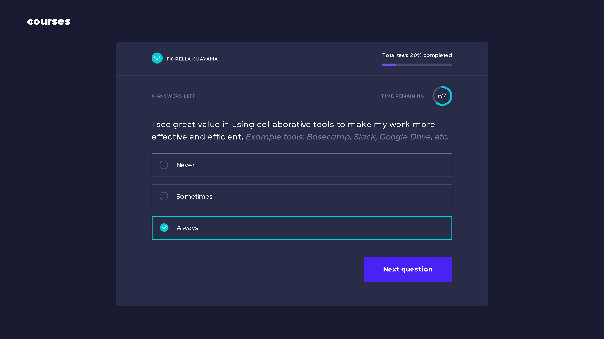
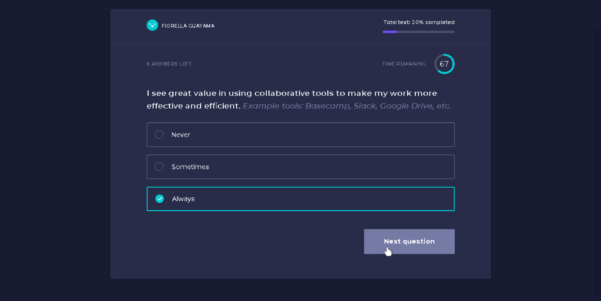

# The Design Preview as Seen on Dribbble

This is the development of a one-page quiz landing page as designed by [Fiorella Guayama](https://dribbble.com/shots/7434980-Landing-Quiz) on Dribbble. 

I had access only to the shot in JPEG format. I got all dimensions and color codes from the image using Adobe Illustrator. Their values may be inaccurate compared to what Fiorella designed but they're very close. With Illustrator, I redesigned her funny logo 😄 and the white checkmark.

## Table of Contents

- [Overview](#overview)
  - [The Challenge](#the-challenge)
  - [Screenshot](#screenshot)
  - [Mobile View](#mobile-view)
  - [Project Live Links](#project-live-links)
- [The Development Process](#the-development-process)
  - [Built With](#built-with)
  - [Cool Stuff I learned](#cool-stuff-i-learned)
  - [Future Development](#future-development)

## Overview

### The Challenge

As a user, you should be able to:

- View the optimal layout depending on their device's screen size `(Still working on this)` **Update** `(Milestone Achieved!)`
- See hover states for interactive elements

### Screenshot

Here're the screenshots of my development:

**Fullscreen Shot**

**Hover State 1**

**Hover State 2**

### Mobile View

**Responsive View**

### Project Live Links

- Github URL: [Link](https://philipsdotdev.github.io/fiorella-guayama-courses-questionnaire-/)
- Netlify URL: [quiz-landing-page-fiorella.netlify.app](https://quiz-landing-page-fiorella.netlify.app/)

## The Development Process

### Built With

- Semantic HTML5 markup
- CSS custom properties
- Flexbox
- CSS Grid
- CSS Animation
- CSS Variables
- Complex CSS gradients manipulation
- Media Query `(Still working on this)` **Update** `(Milestone Achieved!)`

### Cool Stuff I learned

The newest and coolest stuff I learned working on this project is `coding of doughnut pie chart` and the `display: inline-grid` CSS property.

### Future Development

I couldn't add the polygon graphics on the background of the design with code. I could have created it with Illustrator and glue it to the background using css `background-image` property but I want to it using code - probably with the combination of CSS, Javascript, and SVG; I'm not so sure what tech stack that would require. I'll know when I get there.

# Thank You for Reading

## Follow Me on Twitter [@Philipsdotdev_](https://www.twitter.com/Philipsdotdev_)

